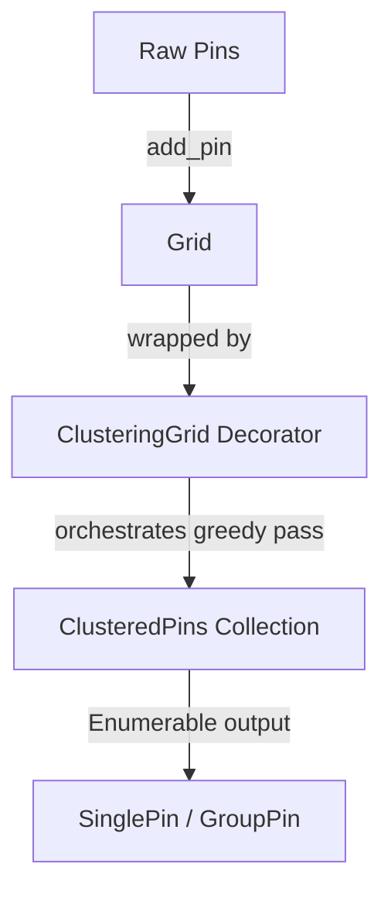

# Handoff: Next Steps for Map Pin Clustering

We completed upgrading the backend stack to **Rails 8.1.3.1** and **Ruby 3.3.4**, updated the frontend to **Vue 3.5.40**, and documented the modular monolith. 

The next item on the roadmap is implementing the map pin clustering algorithm in the `announcements_map` module.

---

## 1. Context & Goal
The frontend displays announcements on a map. To avoid visual clutter and performance issues when there are many close pins, the map needs to cluster pins together. 
The test `test_search_for_pins_in_groups` in [announcements_map_test.rb](file:///Users/krzysztofzielonka/Projects/pets/modules/announcements_map/test/announcements_map_test.rb) is currently failing because this logic is not yet implemented.

---

## 2. Technical Design: Grid & Greedy Clustering (OOP Domain Collection)
To keep the code clean, modular, and object-oriented, we partition the map clustering module into three decoupled objects:

1. **`Grid` (Stateless Binning)**: A simple data structure that maps raw coordinates to `[col, row]` cells within a bounding box. It exposes:
   * `width` / `height` ➔ Accessors for grid dimensions.
   * `number_of_pins(x, y)` ➔ Returns the pin count in that cell.
   * `centroid_of(x, y)` ➔ Returns the average coordinate of pins in that cell (or geographic cell center if empty).
   * `pins_in(x, y)` ➔ Returns a copy of the raw `Pin` objects in that cell.
2. **`ClusteringGrid` (Stateful Decorator)**: Wraps a stateless `Grid` and acts as a stateful adapter for greedy clustering. It exposes:
   * `all_assigned?` ➔ Returns true if all cells containing pins are processed.
   * `next_highest_weight_unassigned` ➔ Returns the coordinate of the unassigned cell with the most pins.
   * `unassigned_cells_within(center, distance_km)` ➔ Returns unassigned cells within distance $D$ of a cell's centroid.
   * `merge_and_assign(cells)` ➔ Mutates internal state to mark cells as assigned, computes the weighted combined centroid, and returns a `Cluster` struct.
3. **`ClusteredPins` (Domain Collection)**: A collection class representing the clustered pins of a search query. It implements Ruby's `Enumerable` module and orchestrates the clustering process.

### Phase 1: Grid Binning (`Grid`)
1. **Grid Partitioning**: Split the viewport bounding box into an $M \times M$ grid.
2. **Cell Mapping**: Assign each pin to a cell using boundary-clamped fraction mapping:
   * `row = [((lat - bottom) / height * M).to_i, M - 1].min`
   * `col = [((lon - left) / width * M).to_i, M - 1].min`
3. **Uniqueness**: Grid enforces that every added pin has a unique ID, raising an informative `ArgumentError` on duplicates.

### Phase 2: Greedy Radius Clustering (`ClusteringGrid` & `ClusteredPins`)
1. **Dynamic Radius**: Compute a dynamic search radius $D = (\text{top} - \text{bottom}) \times 0.08$.
2. **Greedy Clustering Loop**: Inside `ClusteredPins#each`, we use `ClusteringGrid`:
   * Pick the cell `center_cell` with the highest `number_of_pins`.
   * Find all other unassigned cells within distance $D$ of `center_cell`'s centroid.
   * Merge them: calculate a new combined centroid (using weighted average coordinates) and total weight, and mark them as assigned.
   * Repeat until `all_assigned?` is true.
3. **Output Generation**:
   * Clusters with weight = 1 ➔ Return `SearchResults::SinglePin`.
   * Clusters with weight > 1 ➔ Return `SearchResults::GroupPin`.

---

## 3. Action Items for the Next Session
1. **Fix Test Bugs**:
   * Open [announcements_map_test.rb](file:///Users/krzysztofzielonka/Projects/pets/modules/announcements_map/test/announcements_map_test.rb).
   * Fix the parameter typo `longutde` ➔ `longitude` in assertions.
   * Fix `assert_single_pin` to compare with the parameter variable `announcement_id` rather than the literal string `"announcement_id"`.
   * Adjust `assert_has_group_pin` parameters in `test_search_for_pins_in_groups` to verify `4` pins instead of the string `"announcement_id"`.
2. **Implement Algorithm**:
   * Implement the `SearchAlg` class in [search_alg.rb](file:///Users/krzysztofzielonka/Projects/pets/modules/announcements_map/lib/announcements_map/search_alg.rb).
3. **Hook up Facade**:
   * Update `AnnouncementsMap#search` in [announcements_map.rb](file:///Users/krzysztofzielonka/Projects/pets/modules/announcements_map/lib/announcements_map.rb) to use the new `SearchAlg` instead of returning raw pins.
4. **Verify**:
   * Run the test suite: `docker compose exec web /bin/bash -c "cd announcements_map; rake test"` (or locally: `bundle exec rake test` inside the module folder).
