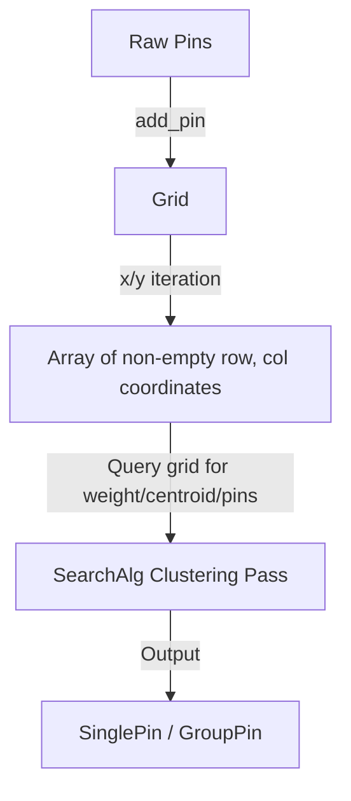

# Handoff: Next Steps for Map Pin Clustering

We completed upgrading the backend stack to **Rails 8.1.3.1** and **Ruby 3.3.4**, updated the frontend to **Vue 3.5.40**, and documented the modular monolith. 

The next item on the roadmap is implementing the map pin clustering algorithm in the `announcements_map` module.

---

## 1. Context & Goal
The frontend displays announcements on a map. To avoid visual clutter and performance issues when there are many close pins, the map needs to cluster pins together. 
The test `test_search_for_pins_in_groups` in [announcements_map_test.rb](file:///Users/krzysztofzielonka/Projects/pets/modules/announcements_map/test/announcements_map_test.rb) is currently failing because this logic is not yet implemented.

---

## 2. Technical Design: Grid & Greedy Clustering (Coordinate-based)
To keep the grid simple and encapsulated, we use a coordinate-based interface on the `Grid` class:

1. **`Grid`**: Maps raw coordinates to `[row, col]` cells within a bounding box. It holds the pins in memory and provides the following interface to `SearchAlg`:
   * `width` / `height` ➔ Accessors for grid dimensions.
   * `number_of_pins_in(row, col)` ➔ Returns the pin count (weight) in that cell.
   * `centroid_of(row, col)` ➔ Returns the average `[latitude_float, longitude_float]` of pins in that cell.
   * `pins_in(row, col)` ➔ Returns the raw `Pin` objects in that cell.
2. **`SearchAlg`**: Orchestrates the greedy clustering algorithm. It queries `Grid` using cell coordinates `[row, col]` to perform distance calculation and centroid merging.

### Phase 1: Grid Binning (`Grid`)
1. **Grid Partitioning**: Split the viewport bounding box `(top, right, bottom, left)` into an $M \times M$ grid.
2. **Cell Mapping**: Assign each pin to a cell using boundary-clamped fraction mapping:
   * `row = [((lat - bottom) / height * M).to_i, M - 1].min`
   * `col = [((lon - left) / width * M).to_i, M - 1].min`
3. **Information Access**: Expose `number_of_pins(x, y)`, `centroid_of(x, y)`, and `pins_in(x, y)`.

### Phase 2: Greedy Radius Clustering (`SearchAlg`)
1. **Dynamic Radius**: Compute a dynamic search radius $D = (\text{top} - \text{bottom}) \times 0.08$.
2. **Greedy Clustering Loop**: Iterate `(1..width)` and `(1..height)` to gather all non-empty cell coordinates into an `unassigned_cells` list:
   * Pick the cell `center_cell` with the highest `grid.number_of_pins(row, col)`.
   * Find all other unassigned cells within distance $D$ of `center_cell`'s centroid.
   * Merge them: calculate a new combined centroid (using weighted average coordinates) and total weight.
   * Remove them from the `unassigned_cells` list.
   * Repeat until `unassigned_cells` is empty.
3. **Output Generation**:
   * Clusters with weight = 1 ➔ Return `SearchResults::SinglePin`.
   * Clusters with weight > 1 ➔ Return `SearchResults::GroupPin`.

---

## 3. Action Items for the Next Session
1. **Fix Test Bugs**:
   * Open [announcements_map_test.rb](file:///Users/krzysztofzielonka/Projects/pets/modules/announcements_map/test/announcements_map_test.rb).
   * Fix the parameter typo `longutde` ➔ `longitude` in assertions.
   * Fix `assert_single_pin` to compare with the parameter variable `announcement_id` rather than the literal string `"announcement_id"`.
   * Adjust `assert_has_group_pin` parameters in `test_search_for_pins_in_groups` to verify `4` pins instead of the string `"announcement_id"`.
2. **Implement Algorithm**:
   * Implement the `SearchAlg` class in [search_alg.rb](file:///Users/krzysztofzielonka/Projects/pets/modules/announcements_map/lib/announcements_map/search_alg.rb).
3. **Hook up Facade**:
   * Update `AnnouncementsMap#search` in [announcements_map.rb](file:///Users/krzysztofzielonka/Projects/pets/modules/announcements_map/lib/announcements_map.rb) to use the new `SearchAlg` instead of returning raw pins.
4. **Verify**:
   * Run the test suite: `docker compose exec web /bin/bash -c "cd announcements_map; rake test"` (or locally: `bundle exec rake test` inside the module folder).
